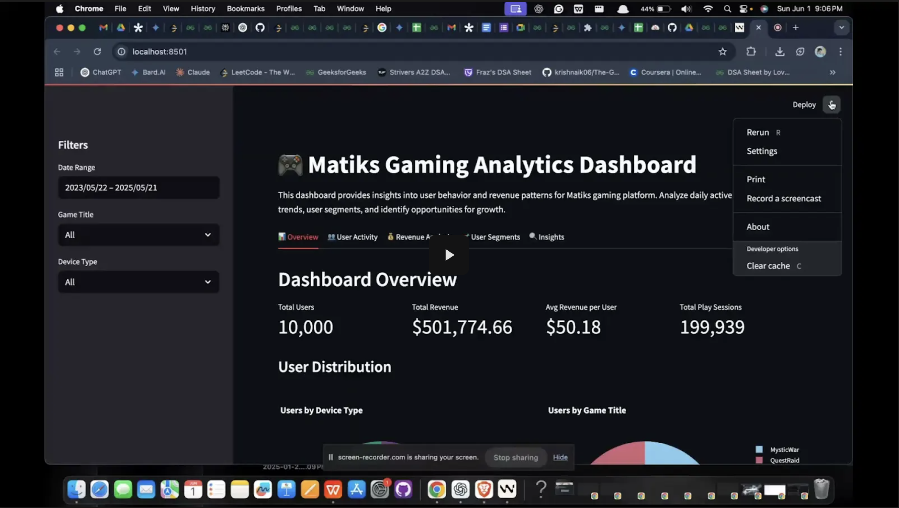

# Matiks Gaming Analytics Dashboard

## Overview
This interactive dashboard analyzes user behavior and revenue data for Matiks gaming platform. It provides insights into user engagement patterns, revenue trends, and user segmentation to help identify opportunities for growth and improvement.

## Features
- **User Activity Analysis**: Track DAU/WAU/MAU metrics and user engagement patterns
- **Revenue Analysis**: Visualize revenue trends and breakdowns by device type, game title, and subscription tier
- **User Segmentation**: Identify distinct user segments based on behavior and spending patterns
- **Cohort Analysis**: Track user cohorts based on signup date to understand lifecycle patterns
- **Key Insights & Recommendations**: Data-driven suggestions to improve retention and revenue

## 📺 Demo Video

[](https://drive.google.com/file/d/1edjKpyBJ5299bzBwH7wf_gAyG8UghcOX/view?usp=drive_link)

Click the above to watch the demo.

## How to Run the Dashboard

### Prerequisites
- Python 3.7+
- Required libraries (install using `pip install -r requirements.txt`):
  - streamlit
  - pandas
  - numpy
  - plotly
  - matplotlib
  - seaborn
  - scikit-learn

### Running the Dashboard
1. Install the required dependencies:
   ```
   pip install -r requirements.txt
   ```

2. Run the Streamlit app:
   ```
   streamlit run app.py
   ```

3. The dashboard will open in your default web browser at `http://localhost:8501`

## Dashboard Structure
The dashboard is organized into five main tabs:

1. **Overview**: General metrics and user demographics
2. **User Activity**: DAU/WAU/MAU tracking and engagement patterns
3. **Revenue Analysis**: Revenue trends and breakdowns by various segments
4. **User Segments**: User clustering and cohort analysis
5. **Insights**: Key findings and actionable recommendations

## Key Insights
- Identification of high-value user segments and their characteristics
- Analysis of revenue distribution across different device types and games
- Early warning signs for potential user churn
- Cohort performance analysis to understand user lifecycle

## Data Source
The analysis is based on the dataset provided in `Matiks - Data Analyst Data - Sheet1.csv`, which contains user-level behavioral and revenue data.

## Author
Created for the Matiks Data Analyst Task
